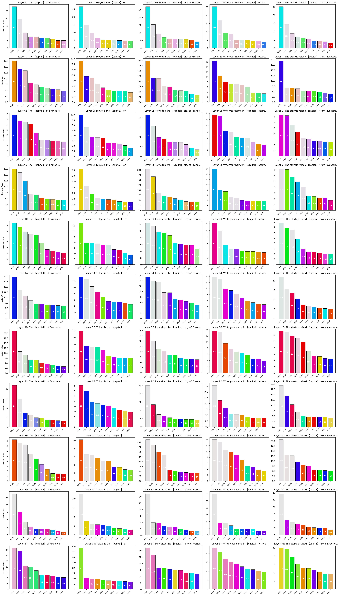

# Llama Scope Demo

Llama-3.1-8B モデルと学習済み Sparse Autoencoder (SAE) を使用して、入力文の潜在表現（スパース特徴）を抽出・保存するCLIツール。

## 主な機能
- Llama-3.1-8Bモデルの指定した全レイヤに対してSAEエンコーディングを実行
- CSVファイルから複数の文を読み込み、トークンごとの特徴を JSONL 形式で出力、棒グラフで可視化

## 使い方

### 1. 環境セットアップ

```bash
# Hugging Face トークンを .env に設定
echo "HF_TOKEN=your_token_here" > .env

# 依存関係のインストール
uv sync
```

### 2. 設定ファイルの編集

`config.yaml` で以下を設定：

```yaml
# モデル設定
model_id: "meta-llama/Llama-3.1-8B"
sae_release: "llama_scope_lxr_8x"
dtype: "float16"  # または "float32"
device: "auto"    # "auto", "mps", "cuda", "cpu"

# レイヤ設定
layers: [0, 1, 2, 6, 10, 14, 18, 22, 26, 30, 31]

# 入力設定
input_csvs:
  - "data/sentences1.csv"
  - "data/sentences2.csv"

# 出力設定
output_dir: "outputs"
```

#### 設定項目の詳細

| 項目 | 説明 | 例 |
|------|------|-----|
| `model_id` | Hugging Face モデルID | `"meta-llama/Llama-3.1-8B"` |
| `sae_release` | SAEリリース名 | `"llama_scope_lxr_8x"` |
| `dtype` | 計算精度 | `"float16"` / `"float32"` |
| `device` | 実行デバイス | `"auto"` / `"mps"` / `"cuda"` / `"cpu"` |
| `layers` | 分析対象レイヤ（0-31） | `[0, 15, 31]` または全レイヤ |
| `input_csvs` | 入力CSVファイルのリスト | 複数指定可、順に結合して処理 |
| `output_dir` | 出力先ディレクトリ | `"outputs"` |

### 3. 実行

```bash
uv run python src/main.py
```

## 入力形式

CSVファイルは1文1行で記述：

```csv
The capital of France is Paris.
Tokyo is the largest city in Japan.
1 + 1 = 2
```

複数のCSVファイルは `config.yaml` の `input_csvs` に指定した順に結合して処理されます。

## 出力形式

```
outputs/
└── run_YYYYMMDD_HHMMSS/
    ├── layer_00/
    │   ├── sentence_0000.jsonl
    │   ├── sentence_0001.jsonl
    │   └── ...
    ├── layer_01/
    │   └── ...
    └── layer_31/
        └── ...
```

各 JSONL ファイルの1行（1トークン）:

```json
{
  "token_pos": 7,
  "token_str": "Paris",
  "nnz": 42,
  "feat_ids": [104, 982, 13001],
  "feat_vals": [1.32, 0.87, 0.41]
}
```

- `token_pos`: トークン位置（0始まり）
- `token_str`: トークン文字列
- `nnz`: 非ゼロ特徴の数
- `feat_ids`: 非ゼロ特徴のインデックス（降順）
- `feat_vals`: 対応する特徴の値（降順）

- `|begin_of_text|` トークンは自動的に除外

## 可視化と頻度スコアリング

可視化ツール（`vis/main.py`）では、SAE特徴の出現頻度に基づいた「頻度スコアリング」とカラーリングを行っています。

### 特徴
- 特徴IDごとに一意のHueを割り当てることで、異なるトークン間で同じ特徴が活性化しているかを一目に確認できます。
- 色の濃さ（彩度）が、その特徴の「文脈における重要度（稀少性）」に対応しています。
-  スコアリングのアルゴリズム
   - 各トークン内での特徴の値のランク（降順）に応じて100位までスコアを付与します（例：1位 100点、2位 99点...）。
   - このスコアを全トークンで平均化します。スコアが低いほど、レアな特徴であることを示します。（ただし、入力の中での相対的な値であることに注意が必要）


## 参考リンク

- [Llama Scope の論文](https://arxiv.org/abs/2410.20526)
- [Hugging Faceで公開されているSAEの重み](https://huggingface.co/OpenMOSS-Team/Llama-Scope)
- [Hugging Faceで公開されている/Llama-3.1-8Bの重み](https://huggingface.co/meta-llama/Llama-3.1-8B)
